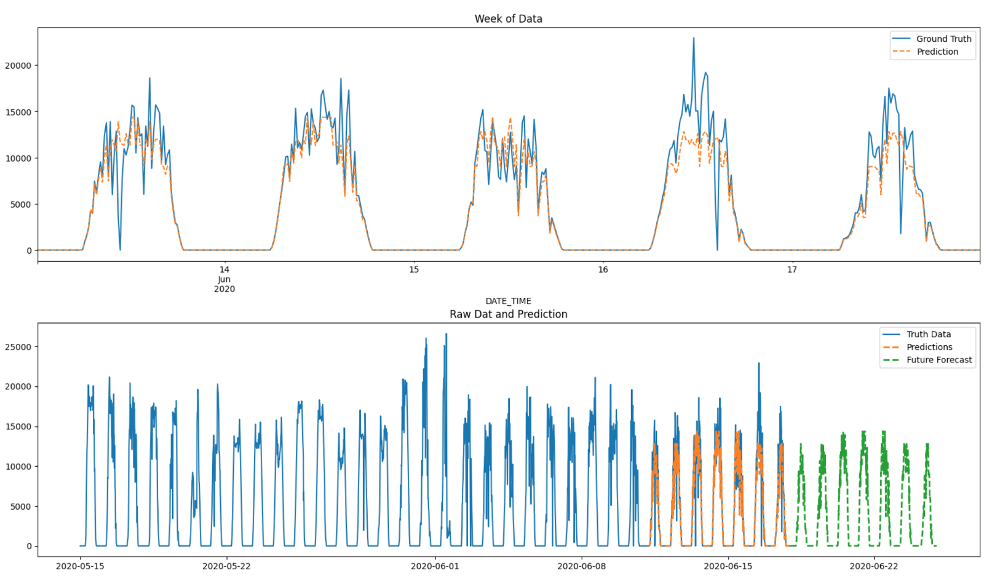
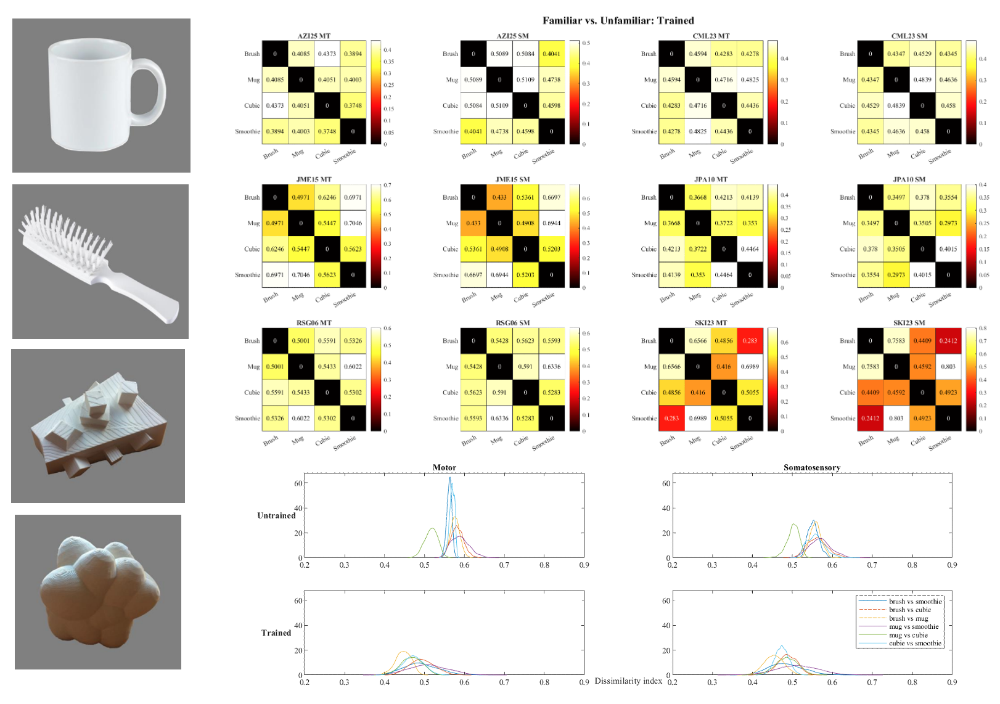
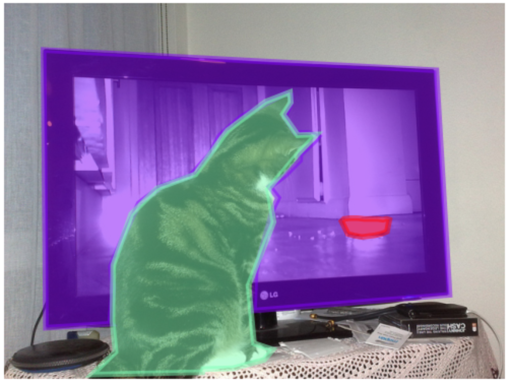

# Portfolio
---
## Data Science

### PV Performance Analysis and Forecasting using XGBoost, 2024

Following an exploration analysis of two PV panels in India over 35 days, I forecasted the DC power output over the next 7 days.

---

### Multivariate Pattern Analysis and Bootstrap Simulation of Neural Representations of Objects, 2023-2024

Previous research ([Smith and Goodale, 2013](https://www.ncbi.nlm.nih.gov/pmc/articles/PMC4380001/)) has shown that haptic information of a familiar object can be predicted in the brain, even if you were only looking at the object without touching it. Interestingly, this is not the case for unfamiliar objects.
At the Muckli Lab, we wanted to find out whether haptic representations of unfamiliar objects changed after allowing participants to interact with a 3D-printed version of the unfamiliar objects, using 7-Tesla fMRI.
Particular to my bachelor's thesis project, I used a method of multivariate pattern analysis called Representational Similarity Analysis, and bootstrap simulation to compare the neural representations of these different objects.

---

### Interactive user interface presenting natural images containing object occlusions, using Streamlit, 2023

Under the lead of Dr Benjamin Peters, a postdoctorate researcher at the Centre for Cognitive Neuroimaging at the time, we conducted explorative analysis on the large Common Objects in Context (COCO) dataset and identified occluded objects from image depth using the ZoeDepth model. Finally, we designed an interactive interface using Streamlit to showcase images with object occlusions.

---

### Correlation between Opposing Valence Items in Psychometric Measures, 2022

This project investigates whether valence in psychometric scales really matters by using the 44-item Big Five Inventory and the SELSA measure for loneliness. The raw dataset is from an unpublished dataset by Gube and Barsalou (2020).

I conducted the following analyses on R:

- subsetting participants from between group conditions
- using for-loops to separate valenced items and generate a mean score per item and participant
- obtaining the correlation between valenced items and its p-values

---

### Correlation between Voice Pitch and Perceived Competence, 2021

Using the data from the Mahrholz et al. 2018 study, we investigated the correlation between voice pitch and their perceived competence in female and male speakers. I conducted the analysis on R, performing a student's t-test, power analysis and Pearson's correlation test.

---
