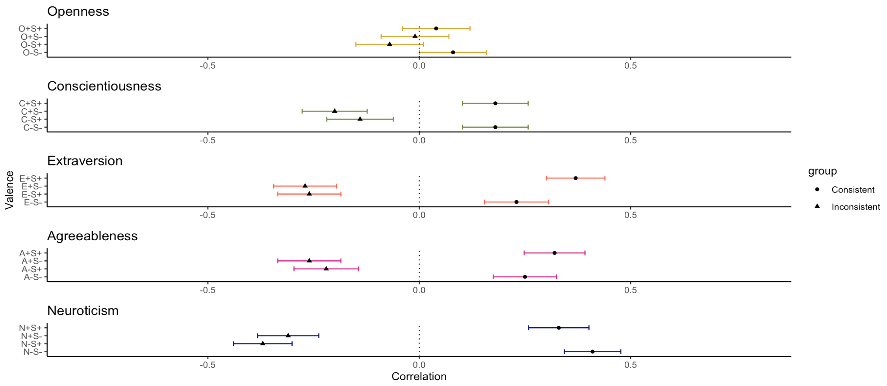
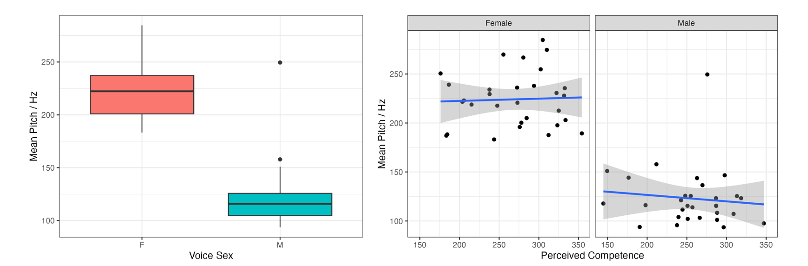

# Portfolio
---
## Data Science

### PV Performance Analysis and Forecasting using XGBoost

Wouldn't it be very useful to know when we need to maintain our equipment before a breakdown?

I conducted an explorative analysis of two PV panels and sensors in India over 35 days, evaluating the performance ratio and conversion efficiency.

Then, I forecasted DC power output from Time, Irradiation and Module Temperature over the next 7 days. ARIMA, Seasonal ARIMA and XGBoost models were used to compare accuracy performance on the predictions. Ultimately, using XGBoost, I improved the model accuracy by over 80% compared to the Seasonal ARIMA model.

---

### Multivariate Pattern Analysis and Bootstrap Simulation of Neural Representations of Objects

Have you ever looked at a fuzzy rug and anticipated what it felt like, without necessarily having felt it before? What you predicted would probably not be too far off the mark.

Previous research ([Smith and Goodale, 2013](https://www.ncbi.nlm.nih.gov/pmc/articles/PMC4380001/)) showed that haptic information of a familiar object can be predicted in the brain, just by looking at it. Interestingly, this is not the case for unfamiliar objects we've never seen before.

At the Muckli Lab, we wanted to find out whether haptic representations of unfamiliar objects changed after allowing participants to interact with a 3D-printed version of the unfamiliar objects, using 7-Tesla fMRI.
Particular to my bachelor's thesis project, I used a method of multivariate pattern analysis called Representational Similarity Analysis, and bootstrap simulation to compare the neural representations of these different objects.

---

### Interactive user interface presenting natural images containing object occlusions, using Streamlit

Did you know, that if an object, i.e., a bookshelf, is partially occluded by another, i.e., a mug, the human brain can predictively complete the occluded imagery of the bookshelf?

We know this to be true from previous research. However, most experimental set-ups feature monochrome images with a white rectangle on the lower right corner. What if we used object occlusions in natural images, e.g., a snapshot of your work desk ?

As a preliminary stage to the project, Dr Benjamin Peters and I used the large Common Objects in Context dataset of over 200K labelled images. We conducted an explorative analysis and automated an image detection for occluded objects using the ZoeDepth model for image depth. Finally, we developed an interactive interface using Streamlit to showcase images with object occlusions.

---

### Correlation between Opposing Valence Items in Psychometric Measures

Do you ever respond differently to a question depending on how it's asked? If you give me a glass of water and either asked me the proportion of how "empty" it was, or how "full" it was, do you think I would respond equally to both questions?

This project investigates whether valence in psychometric scales really matters by using the 44-item Big Five Inventory and the SELSA measure for loneliness. The raw dataset is from an unpublished dataset by Gube and Barsalou (2020).

I conducted the following analyses on R:

- subsetting participants from between group conditions
- using for-loops to separate valenced items and generate a mean score per item and participant
- obtaining the correlation between valenced items and its p-values

---

### Correlation between Voice Pitch and Perceived Competence

If you heard a deep voice speaking, what would you deduce about their competence? Now, think of a high-pitched voice. How would you perceive this person's competence?

Using the data from the Mahrholz et al. 2018 study, we investigated the correlation between voice pitch and their perceived competence in female and male speakers. I conducted the analysis on R, performing a student's t-test, power analysis and Pearson's correlation test.

---
